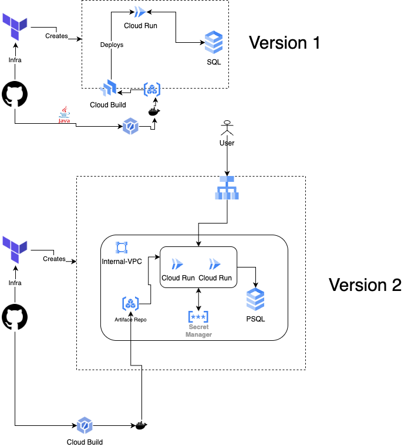

# Application 
### Terraform
- Cloud Run 
Pipeline 
- Actions (Terraform)
- Cloud Build (Build and store to Artifact Registry)
### Infrastructure
- Cloud Run 
- Artifact Registry
- PSQL
### Application
- Quarkus based application reads and stores list data on PSQL

Something about GCP workflow 

Actions -> terraform plan -> apply (Infra)
Code Build -> Build quarkus -> Artifact registry (image)
GCP code Deploy ?  

